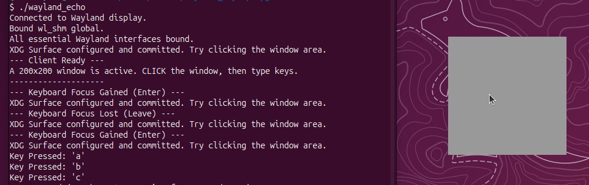

# wayland_keyinput

## About
This sample program uses the Wayland C library to retrieve and display key inputs.
It was created using Gemini.



Confirmed to be working on Ubuntu 25.10.

## Prerequisite
| Library Package   | Role in Code | apt install Command |
| :-------: | ---------------- | ------ |
|libwayland-dev|Provides the core libwayland-client.so and header files (wayland-client.h) for connecting to the compositor.|sudo apt install libwayland-dev|
|libxkbcommon-dev|Provides the libxkbcommon.so and headers needed for translating raw key events into characters.|sudo apt install libxkbcommon-dev|
|libwayland-protocols-dev|Provides the XML definitions (xdg-shell.xml) and the necessary internal linking symbols for protocols like XDG Shell and wl_shm.|sudo apt install libwayland-protocols-dev|
|wayland-scanner|The utility program used to automatically generate the .h and .c files from the protocol XML definitions.|sudo apt install wayland-scanner|

Ubuntu25.10 don't have libwayland-protocols-dev. Need wayland-protocols installed.

And need to generate xdg-shell-client-protocol.h and xdg-shell-protocol.c from xdg-shell.xml

## Build Instructions

- Clone the [wayland_keyinput repository](https://github.com/jianwu13/wayland_keyinput.git):

    ```bash
    git clone git@github.com:jianwu13/wayland_keyinput.git
    ```

- make

    ```bash
    make
    ```

	or

    ```bash
    gcc wayland_echo.c xdg-shell-protocol.c -o wayland_echo $(pkg-config --cflags --libs wayland-client xkbcommon)
    ```

## Generate the Header File Manually:

    
    dpkg -L wayland-protocols | grep xdg-shell.xml
    

Expected output path is likely similar to: /usr/share/wayland-protocols/stable/xdg-shell/xdg-shell.xml

Replace the path below with the actual path found via dpkg -L

    
    wayland-scanner client-header /usr/share/wayland-protocols/stable/xdg-shell/xdg-shell.xml xdg-shell-client-protocol.h
    
## Generate the Protocol C Implementation

    
    wayland-scanner private-code /usr/share/wayland-protocols/stable/xdg-shell/xdg-shell.xml xdg-shell-protocol.c

## Tips
### Finding Development Libraries for Header Files

    $ sudo apt-file update

    $ apt-file search <header_file.h>

    $ apt-file find <header_file.h>
